# Manual de usuario — Sistema Agua Pura

Versión funcional: fases 0–39
Ámbito: una sola empresa purificadora  
Moneda y zona iniciales: configurables; valores usuales `GTQ` y `America/Guatemala`

## 1. Propósito

El sistema administra la operación completa de una purificadora: empresa, usuarios, vendedores, clientes, rutas, vehículos, productos, precios, inventario, cargas, ventas, pagos, mermas, devoluciones, liquidaciones, autorizaciones, anulaciones, comprobantes, reportes y auditoría. La aplicación del vendedor funciona como PWA y conserva operaciones móviles en IndexedDB cuando se pierde la conexión.

> PostgreSQL es la fuente oficial. Una operación offline no se considera oficial hasta que el menú **Pendientes** indique que fue sincronizada.

## 2. Perfiles de acceso

| Perfil | Trabajo principal |
|---|---|
| Administrador | Configuración de la empresa, usuarios, catálogos, precios, operación, reportes y auditoría. |
| Bodega | Inventario, preparación/entrega de cargas, recepción de devoluciones y revisión física de mermas. |
| Supervisor | Seguimiento operativo, aprobaciones, transferencias, liquidaciones, incidencias, reportes y auditoría. |
| Vendedor | Recepción de carga, clientes de su ruta, ventas/pagos, operaciones offline, mermas, devoluciones y comprobantes. |

Los menús se muestran según el perfil. Que una opción no aparezca significa que el usuario no tiene autorización para esa función. En teléfonos, pulse **Menú** en la barra inferior para abrir el panel desplazable con todas las opciones autorizadas; pulse **Cerrar menú** para ocultarlo.

## 3. Iniciar y cerrar sesión

1. Abra la dirección entregada por el administrador del servidor.
2. Ingrese **Usuario**, **Contraseña** y un nombre identificable para el dispositivo, por ejemplo `Teléfono Juan`.
3. Pulse **Ingresar**.
4. Si recibió una contraseña temporal, el sistema exigirá cambiarla antes de permitir otra operación.
5. Al terminar, pulse **Cerrar sesión**. En un teléfono compartido, no deje la sesión abierta.

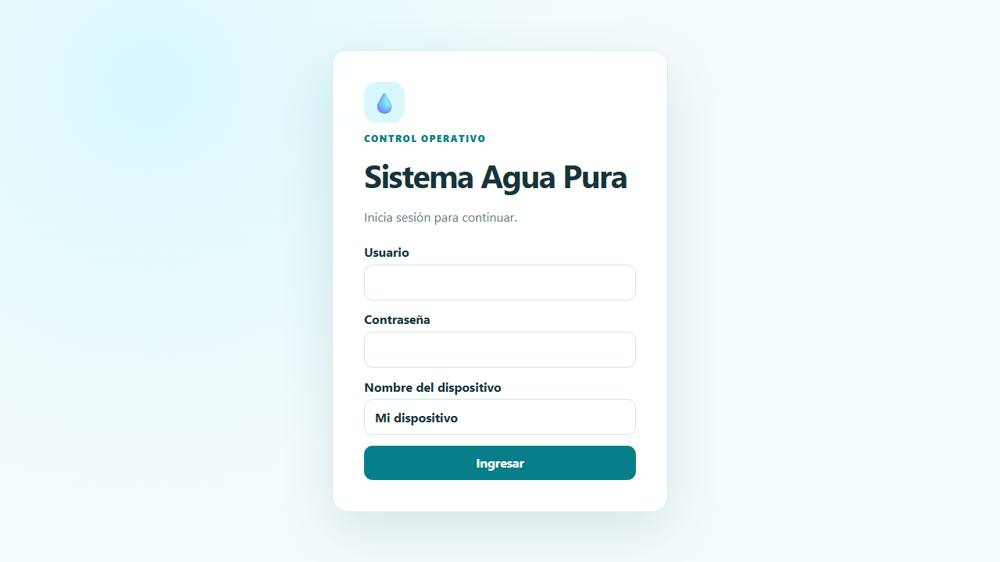

No existe una contraseña universal documentada. El usuario inicial es `admin`; su contraseña se define de forma privada en `.env` durante la instalación. Las contraseñas temporales de otros usuarios las asigna el administrador y deben cambiarse al primer ingreso.

## 4. Indicador de conexión

El botón superior puede mostrar:

- **En línea:** el servidor respondió y se pueden confirmar operaciones oficiales.
- **Comprobando:** se está validando la conexión.
- **Conexión limitada:** hay red, pero el servidor no respondió correctamente.
- **Sin conexión:** use únicamente las funciones offline disponibles.
- **Estado desconocido:** todavía no terminó la comprobación inicial.

El botón permite comprobar la conexión manualmente. Una barra o un indicador de Internet del teléfono no reemplaza la confirmación del sistema.

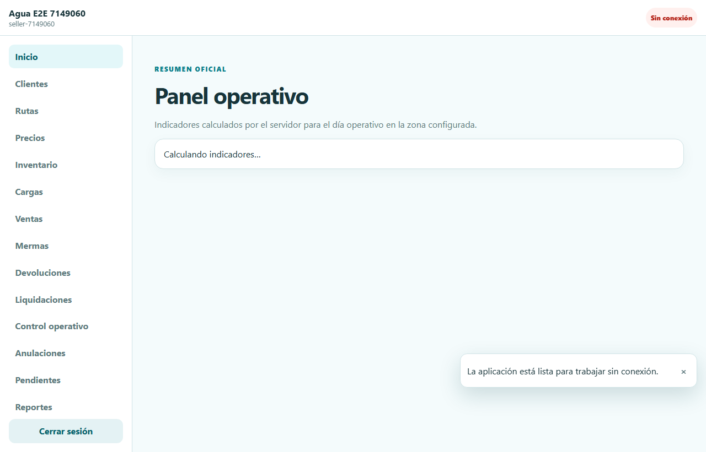

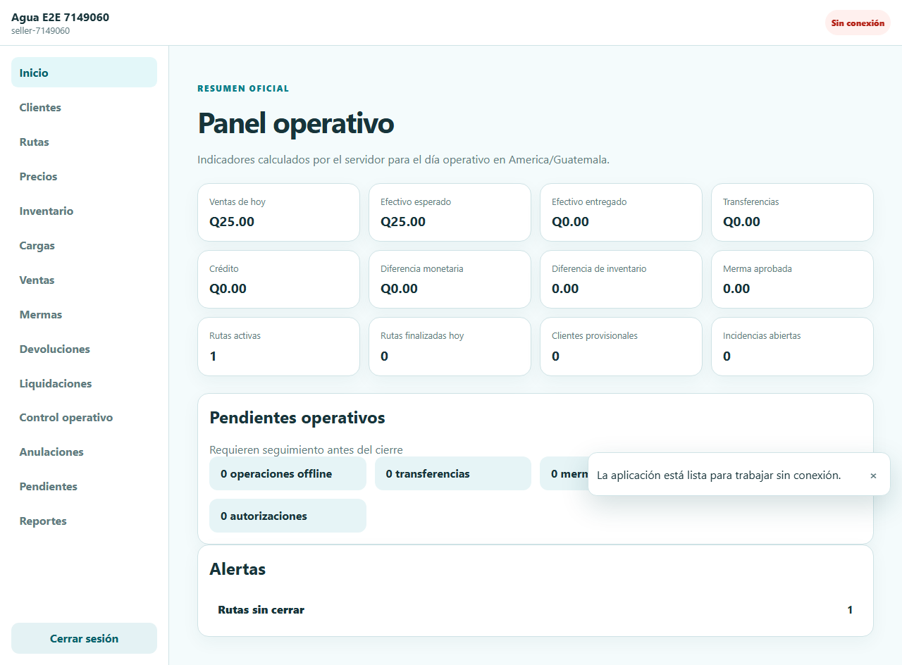

## 5. Puesta en marcha administrativa

Realice la configuración en este orden para evitar catálogos incompletos.

### 5.1 Datos de la empresa

En **Datos de la empresa** complete un único formulario con:

- logotipo PNG, JPG o WebP de hasta 2 MB;
- nombre comercial, razón social y NIT;
- dirección, teléfono, WhatsApp y correo;
- moneda y zona horaria;
- prefijo y siguiente número de comprobante;
- texto o leyenda para documentos.

Estos datos se usan en la aplicación y en los comprobantes. El logotipo guardado aquí se incrusta en los comprobantes internos y en los reportes exportados a Excel o PDF; las ventas conservan una copia histórica del logotipo vigente al confirmarse. Revise especialmente la numeración antes de iniciar ventas; el servidor asigna el correlativo oficial y evita duplicados.

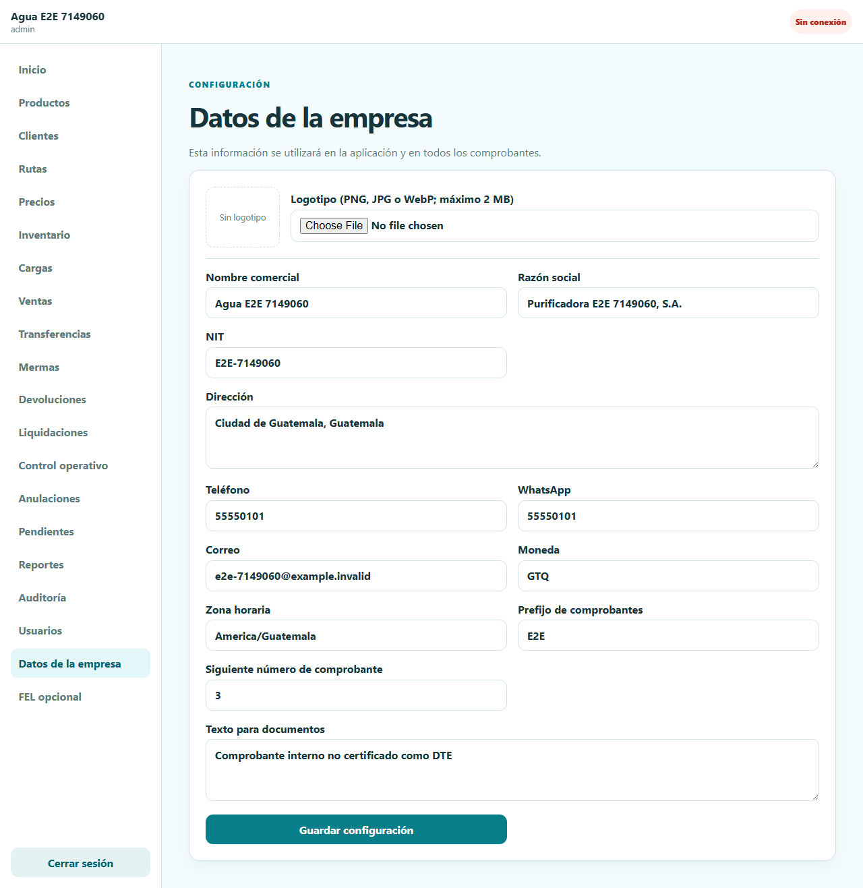

### 5.2 Usuarios y vendedores

En **Usuarios**:

1. Escriba usuario, correo y contraseña temporal.
2. Seleccione uno o más roles.
3. Si el rol es **Vendedor**, ingrese el nombre visible; el sistema asigna automáticamente el código `VND-000001` consecutivo.
4. Guarde y entregue la contraseña temporal de forma privada.
5. Use el listado de dispositivos para revocar un teléfono perdido o que ya no debe operar.

Desactivar un usuario bloquea sus tokens vigentes. Nunca comparta una cuenta entre vendedores, porque las ventas, dispositivos y eventos de auditoría quedan asociados a la identidad autenticada.

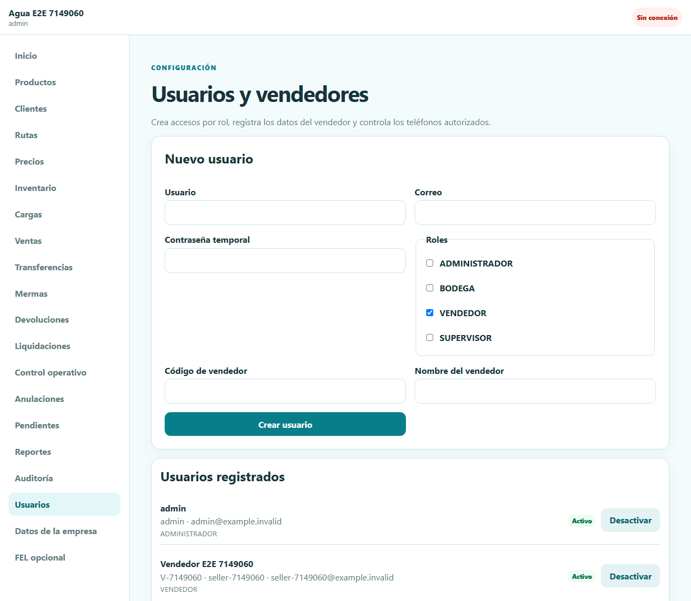

### 5.3 Productos y presentaciones

En **Productos** cree primero el producto en su unidad base, por ejemplo botella o garrafón. Agregue cada presentación comercial y su factor de conversión. Ejemplo: un fardo de 12 botellas debe convertir a 12 unidades base, no a la cantidad de fardos.

No cambie una conversión histórica para corregir ventas anteriores. Cree o active la definición correspondiente y conserve la trazabilidad.

### 5.4 Precios y mayoreo

En **Precios**:

1. Cree la lista con su moneda.
2. Cree una versión con fecha de vigencia.
3. Agregue tramos por presentación y cantidad mínima.
4. Active la versión que debe usarse.
5. Registre precios especiales o solicitudes de descuento solo cuando corresponda.

La pantalla **Registrar precios** se utiliza únicamente para capturar nuevas reglas y solicitudes. El botón **Ver precios registrados** abre una vista separada para consultar listas, versiones, tramos, precios especiales, solicitudes y estados sin duplicar información ni mezclar la consulta con los formularios.

El precio, el descuento y los totales finales los calcula el servidor. El vendedor no debe calcular manualmente el total oficial.

### 5.5 Rutas, vehículos y clientes

En **Rutas** cree las rutas y los vehículos. El sistema asigna automáticamente los códigos `RUT-000001` y `VEH-000001`; la placa del vehículo continúa siendo manual. Después asigne vendedor y vehículo con una fecha de inicio; estas asignaciones son históricas.

En **Clientes** registre datos de contacto, dirección, tipo y reglas de crédito. El código `CLI-000001` se genera al guardar. Asigne cada cliente a una ruta. El vendedor solo puede ver o usar los clientes autorizados de su alcance.

Un cliente encontrado durante el reparto puede registrarse como ocasional/provisional, incluso offline. No se habilitan crédito ni precios especiales hasta que un administrador o supervisor revise su identidad.

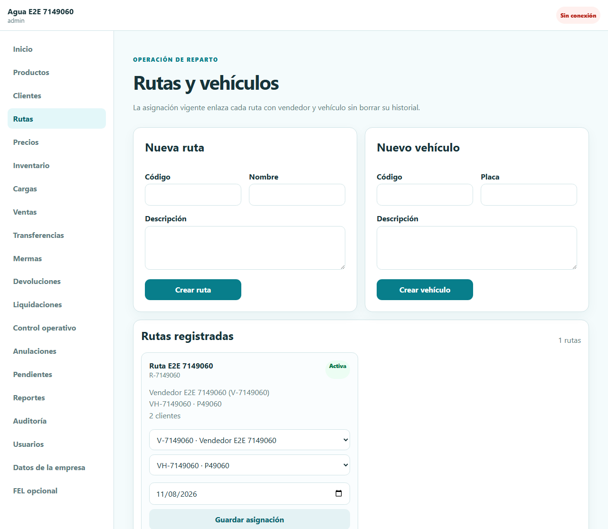

## 6. Inventario y carga de ruta

### 6.1 Ubicaciones y existencia

En **Inventario**, bodega crea:

- una ubicación tipo **Bodega** para existencia central;
- una ubicación tipo **Ruta** asociada a cada ruta.

Los ajustes requieren cantidad y motivo. El libro de movimientos es de solo lectura; las correcciones se registran como movimientos compensatorios y no borran el historial.

### 6.2 Preparar una carga

1. Abra **Cargas** y seleccione ruta, bodega origen y fecha.
2. Agregue productos en unidades base.
3. Pulse **Preparar carga**.
4. Bodega verifica físicamente y confirma la entrega desde su dispositivo.
5. El vendedor ingresa desde su propio dispositivo y pulsa **Confirmar recepción**. El teléfono solicita una sola ubicación para registrar el inicio de la ruta.
6. El vendedor inicia el recorrido.

La misma persona/dispositivo no debe simular las dos confirmaciones. El sistema conserva quién confirmó cada etapa. Si el permiso de ubicación se deniega o el teléfono no puede obtenerla, la recepción no se confirma: active el permiso y vuelva a intentarlo. La aplicación no vigila su ubicación durante el recorrido ni realiza capturas en segundo plano.

### 6.3 Recarga durante el recorrido

Si al vendedor se le termina un producto, bodega abre **Cargas → Nueva recarga de ruta**, selecciona la ruta que ya tiene el recorrido iniciado, la bodega origen y los productos/cantidades adicionales. La recarga sigue el mismo control de doble confirmación:

1. Bodega la prepara y confirma la entrega.
2. El vendedor la recibe desde su teléfono.
3. El sistema mueve el inventario de bodega a la ubicación de ruta y deja auditoría de ambos usuarios.

Una recarga no inicia otro recorrido, no crea otra liquidación y se suma a la conciliación del recorrido original. No se permite crearla cuando la liquidación de esa ruta ya fue cerrada ni dejar una recarga pendiente al intentar cerrar.

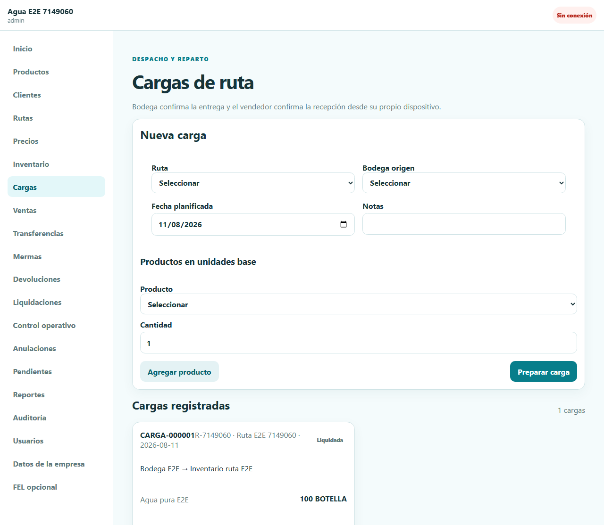

## 7. Venta y pago

En **Ventas**:

1. Seleccione la ruta y el cliente.
2. Agregue presentación y cantidad.
3. Seleccione efectivo, transferencia o crédito según las reglas del cliente.
4. En un único medio de pago puede dejar el monto vacío para aplicar el total calculado por el servidor.
5. Pulse **Confirmar venta** y permita una única ubicación para esa venta.

Si se deniega el permiso o no se puede obtener la ubicación, la venta no se confirma y puede intentarlo otra vez después de corregir el permiso o la señal. No hay seguimiento continuo. La ubicación se conserva únicamente para control interno de los eventos de ruta; no aparece en el comprobante compartido con el cliente ni en los reportes operativos.

El sistema valida vendedor/ruta, precio vigente, crédito disponible, inventario, correlativo y total en una sola transacción. Una venta rechazada no debe descontar inventario ni consumir numeración.

Para transferencias, el supervisor debe comprobar la referencia/evidencia. El usuario que registra no debe ser el mismo que verifica cuando la segregación aplique.

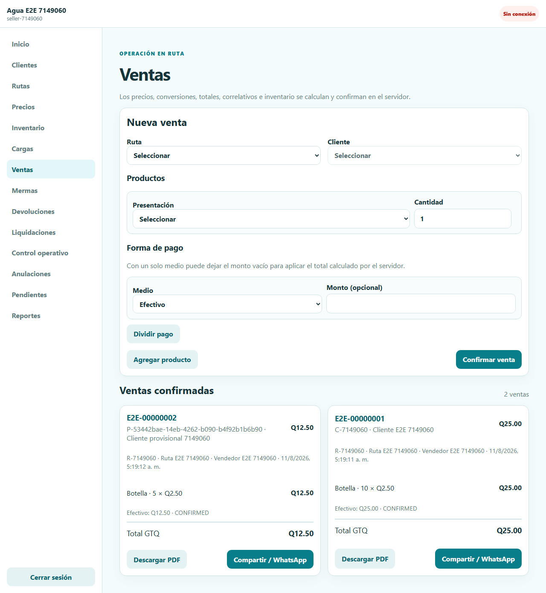

### 7.1 Comprobante

Desde la venta confirmada puede:

- descargar el PDF interno;
- usar **Compartir / WhatsApp** en un teléfono compatible;
- volver a descargar el documento histórico.

## 8. Operación offline y sincronización

Antes de salir, el vendedor debe iniciar sesión con Internet y abrir la información necesaria de su ruta. Cuando se pierde la conexión:

1. La PWA conserva su interfaz instalada/cacheada.
2. Las operaciones permitidas se guardan localmente con UUID estable.
3. Venta, pago, inventario local y entrada de Outbox se confirman en una sola transacción IndexedDB.
4. **Pendientes** muestra el estado y los reintentos.
5. Al recuperar conexión, pulse sincronizar si el envío automático todavía no comenzó.

Estados comunes:

| Estado | Acción del usuario |
|---|---|
| Pendiente / reintentable | Conserve la sesión y vuelva a sincronizar con conexión estable. |
| Sincronizado | La operación ya tiene resultado oficial. |
| Conflicto | No repita manualmente la venta; solicite revisión. |
| Rechazado | Lea el motivo y corrija mediante el flujo autorizado. |

No borre los datos del sitio, IndexedDB ni la PWA con operaciones pendientes. No cierre una liquidación mientras el contador de operaciones locales sea mayor que cero.

## 9. Mermas y devoluciones

### 9.1 Merma

Use **Mermas** para pérdida física: rotura, contaminación u otra causa configurada. Registre tipo, presentación, cantidad, recuperable, motivo y evidencia cuando la política lo exija. Bodega/supervisor revisa y puede aprobar parcialmente. La aprobación genera el movimiento de inventario correspondiente.

### 9.2 Devoluciones

Use **Devoluciones** para producto no vendido o devuelto por un cliente. Bodega cuenta la cantidad recibida y registra su recepción. No registre producto sano no vendido como merma.

## 10. Liquidación de ruta

En **Liquidaciones**:

1. Verifique que la ruta no tenga operaciones offline pendientes.
2. Calcule la conciliación.
3. Compare carga, ventas, mermas aprobadas, devoluciones y existencia física.
4. Registre la entrega de efectivo y quién la recibe.
5. Revise diferencias físicas y monetarias.
6. Si corresponde, cree una incidencia/autorización antes del cierre.
7. Cierre la liquidación.

Una liquidación cerrada y su carga liquidada no se reabren modificando filas históricas.

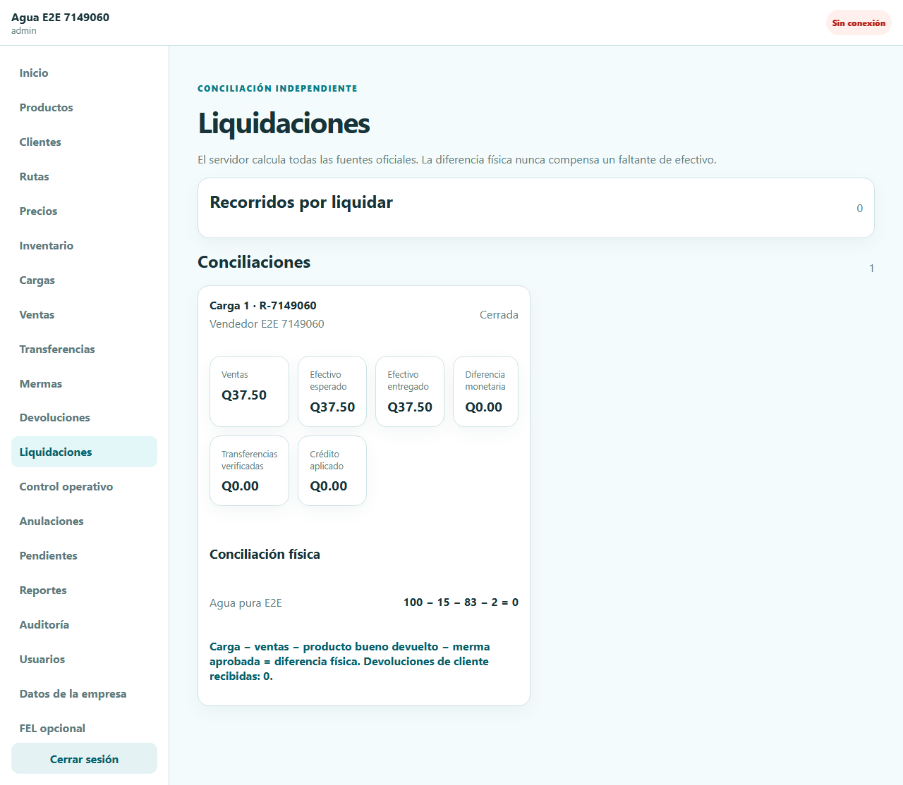

## 11. Control operativo y anulaciones

**Control operativo** permite crear solicitudes con vigencia e incidencias asociadas a una ruta o liquidación. El solicitante no debe aprobar su propia solicitud cuando la regla exige segregación.

En **Anulaciones**, el vendedor/usuario autorizado solicita la anulación de una venta y explica el motivo. Administrador o supervisor decide. Una aprobación crea reversos compensatorios de inventario, pago y crédito; la venta original permanece inmutable para auditoría.

## 12. Panel, reportes y auditoría

El panel muestra indicadores oficiales en la zona horaria de la empresa: ventas, efectivo esperado/entregado, transferencias, crédito, diferencias, merma, rutas, provisionales, pendientes y alertas.

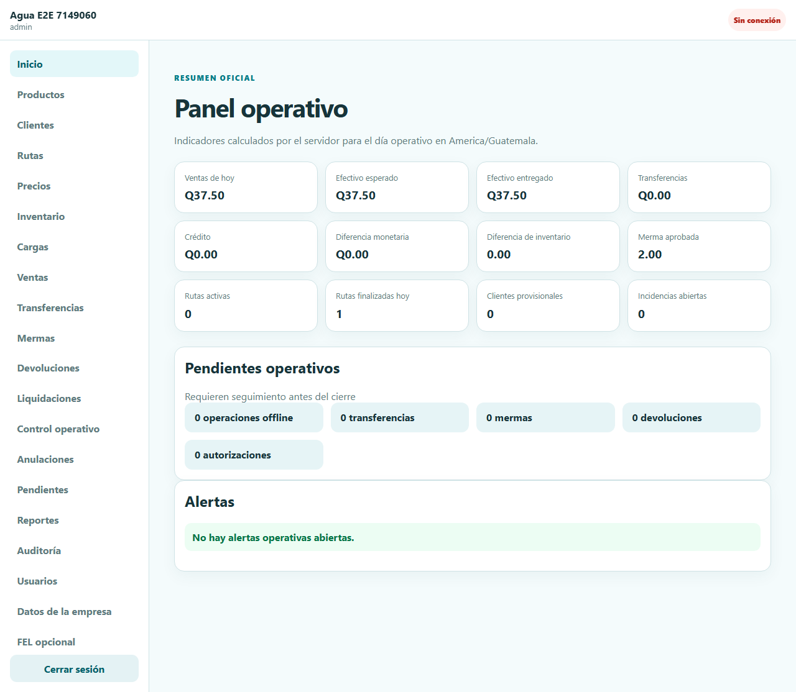

En **Reportes** seleccione ventas, mermas o liquidaciones, aplique fechas/filtros y use **Exportar … a Excel** para obtener `.xlsx` o **Imprimir / descargar PDF** para generar un documento imprimible con el logotipo e identidad de la empresa y los filtros aplicados. Los resultados se paginan y respetan el alcance del rol; no se ofrece CSV como formato operativo.

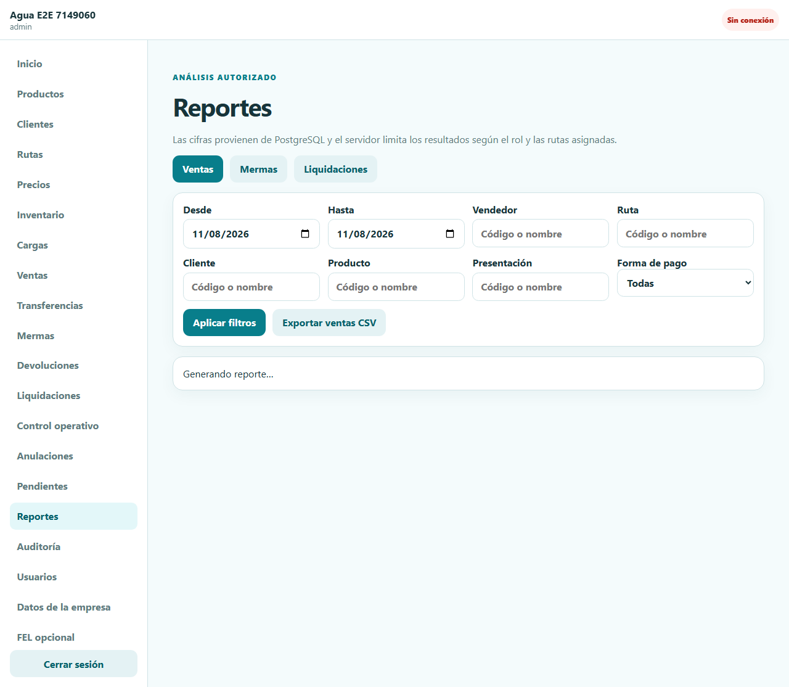

## 14. Reglas de seguridad para usuarios

- No comparta contraseñas ni cuentas.
- Use un nombre único por dispositivo.
- Cambie de inmediato la contraseña temporal.
- Cierre sesión al entregar o perder un teléfono y solicite revocación del dispositivo.
- Verifique cliente, cantidades y forma de pago antes de confirmar.
- No repita manualmente una operación que aparece pendiente: sincronícela.
- Registre correcciones y anulaciones por sus flujos; nunca intente borrar el historial.

## 15. Solución de problemas

| Situación | Qué hacer |
|---|---|
| No puedo iniciar sesión | Compruebe usuario, contraseña y mayúsculas. Espere si hubo muchos intentos; informe al administrador sin enviar la contraseña. |
| Se exige cambiar contraseña | Complete el cambio; las demás rutas están bloqueadas hasta hacerlo. |
| Aparece “Sin conexión” después de dejar el sistema abierto | El access token dura pocos minutos; la aplicación intenta renovarlo automáticamente mediante la cookie segura y repite la solicitud una vez. Si la renovación falla, inicie sesión de nuevo. Un error 401 no significa que PostgreSQL esté caído. |
| Una operación sigue pendiente | Mantenga la PWA abierta, recupere conexión y use **Pendientes → Sincronizar**. |
| Hay conflicto/rechazo | No duplique la venta. Tome nota del UUID/referencia y solicite revisión. |
| No aparece un cliente/producto | Verifique ruta, vigencia, estado activo y permisos; vuelva a sincronizar. |
| No se puede cerrar liquidación | Resuelva operaciones pendientes, devoluciones, diferencias o autorizaciones. |

Para soporte entregue: usuario, fecha/hora, pantalla, número de documento o UUID, ruta y mensaje exacto. Nunca entregue contraseña, JWT, refresh cookie ni secretos.
